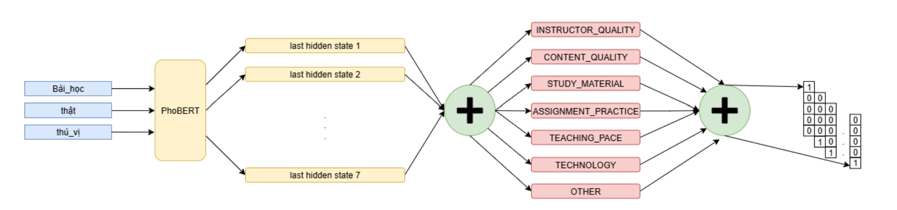

# ELearning Aspect-Based Sentiment Analysis (ABSA)

<p align="center">
  
</p>

A **Flask-based microservice** and **submodule** of the [Nova Learn Backend](../nova-learn-backend/README.md), designed to perform **Aspect-Based Sentiment Analysis (ABSA)** on Vietnamese learner feedback.

This service uses a **fine-tuned PhoBERT model** trained on the **ViLearn-ABSA** dataset to classify sentiment into **positive**, **negative**, **neutral**, or **conflicted** across seven educational aspects:

- **Instructor Quality** 👩‍🏫
- **Content Quality** 📚
- **Assignments & Practice** 📝
- **Materials** 📄
- **Pace** ⏱️
- **Technology** 🖥️
- **Others** 🔍

The results are consumed by the **Nova Learn backend** to power its **analytics dashboard**, helping instructors visualize insights and improve course quality.

---

## **Reference**



This submodule is based on our research:

> **Exploiting Aspect-Based Sentiment Analysis on Vietnamese Learner Feedback: Dataset Foundation and Applications for E-learning System Enhancement**  
> _Mai Dinh Khoi, Le Thi Thu Hien, Nguyen Thi Thanh Truc_  
> [Read the Document](./docs/Research_Paper.pdf)

---

## **Installation**

### **1. Clone the repository**

```bash
git clone https://github.com/KhoiMaiDinh/ELearning_Aspect-Based_Sentiment_Analysis.git
```

### **2. Create and activate a virtual environment**

```bash
python -m venv venv
source venv/bin/activate  # On Windows use `venv\Scripts\activate`
```

### **3. Install dependencies**

```bash
pip install -r requirements.txt
```

### **4. Download the fine-tuned PhoBERT model model**

Place the model in:

```bash
./models/full.h5
```

> **Contact the maintainer if you need access to pre-trained weights.**

---

## **Running the Service**

**Start the Flask Server**

```bash
python app.py
```

**By default, the server runs on:**

`http://localhost:5000`

## **How It Works**

### **1. Input**

- Listens to Kafka topic:
  `comment.fixed.topic`
- Receives **learner comments** from the Nova Learn backend.

### **2. Processing**

- Preprocesses text using **VnCoreNLP** and normalization techniques.
- Uses **PhoBERT** fine-tuned on the **ViLearn-ABSA** dataset.
- Performs **aspect-based sentiment classification**.

### **3. Output**

- Publishes structured sentiment results to Kafka topic:
  `comment-processed.fixed.topic`

### **4. Integration**

- Consumed by the **Nova Learn backend** for analytics.
- Provides **notification system** for real-time sentiment analysis updates.

## **Docker Support** 🐳

You can run the service with Docker:

```bash
docker build -t nova-learn-absa .
docker run -p 5000:5000 nova-learn-absa
```

### **Integration with Nova Learn**

This microservice is consumed by the Nova Learn API Server for:

- Lecture comment analytics
- Course feedback dashboards
- Instructor performance insights

See the [Nova Learn Backend README](https://github.com/KhoiMaiDinh/ELearning_BE/blob/main/README.md)
for integration details.

### Dataset

**ViLearn-ABSA Dataset Details:**

- **Name:** ViLearn-ABSA
- **Size:** 10,077 learner feedback entries
- **Aspects:**
  - Instructor
  - Content
  - Assignments
  - Materials
  - Pace
  - Technology
  - Others
- **Sentiment Categories:**
  - Positive
  - Negative
  - Neutral
  - Conflicted
- **Quality Metrics:**
  - Annotation Reliability: Cohen's Kappa = 0.957

> Access the complete dataset on [Kaggle](https://www.kaggle.com/datasets/khimainh/asba-elearning-comment-dataset) (CSV format)

## Contact

For questions or support, please contact:

- **Email:** khoimd.dev@gmail.com
- **GitHub Issues:** [ELearning_Aspect-Based_Sentiment_Analysis](https://github.com/KhoiMaiDinh/ELearning_Aspect-Based_Sentiment_Analysis/issues)
